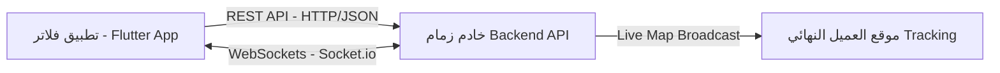

# خطة تكامل نظام زمام مع تطبيق موبايل فلاتر (Flutter Mobile Integration Plan)

لربط نظام زمام (Zimam POS) بتطبيق جوال مبني بإطار العمل **فلاتر (Flutter)**، يجب تحديد هوية التطبيق المستهدف أولاً. في بيئات المطاعم ونقاط البيع، هناك ثلاثة تطبيقات جوال أساسية محتملة:
1. **تطبيق طياري التوصيل (Delivery Riders / Bikers App)**: لاستلام الطلبات وتغيير حالتها وتتبع موقع السائق (الأكثر طلباً تشغيلياً).
2. **تطبيق العميل النهائي (Customer Ordering App)**: لتصفح المنيو، الطلب، والدفع الإلكتروني.
3. **تطبيق الإدارة والتقارير (Owner Dashboard App)**: لمتابعة المبيعات والتقارير المالية والتحكم بالفروع عن بُعد.

يركز هذا المستند على **خطة الربط البرمجي المشتركة** مع التركيز على **تطبيق التوصيل (Delivery App)** لتكامله المباشر مع موديولات المخزن والمبيعات الحالية.

---

## 🏗️ 1. البنية التقنية للربط (Architecture of Integration)

يتصل تطبيق فلاتر بخادم زمام الخلفي عبر قناتين رئيسيتين:
* **قناة REST API**: للعمليات الثنائية التقليدية (تسجيل الدخول، جلب قائمة الطلبات، تحديث الحالات، إدارة الملف الشخصي).
* **قناة WebSockets (Socket.io)**: للعمليات اللحظية (تحديث موقع السائق GPS وإرساله للعميل، واستقبال إشعارات بوجود طلبات جديدة للطيار).



---

## 🔑 2. طبقة المصادقة والأمان (Authentication Flow)

يستخدم نظام زمام الـ **JWT (JSON Web Tokens)** لإدارة الجلسات والأمان.

### خطوات المصادقة في فلاتر:
1. **تسجيل الدخول (Login)**:
   - يرسل التطبيق طلب `POST` إلى `/api/auth/login` يحتوي على اسم المستخدم وكلمة المرور.
   - يعود الخادم بـ `accessToken` (صالح لفترة قصيرة، مثلاً 15 دقيقة) و `refreshToken` (صالح لفترة طويلة، مثلاً 7 أيام).
2. **تخزين البيانات**:
   - يتم تخزين الـ `accessToken` والـ `refreshToken` بشكل آمن في الجوال باستخدام مكتبة `flutter_secure_storage`.
3. **تجديد التوكن تلقائياً (Silent Token Refresh)**:
   - يتم ضبط مكتبة `Dio` في فلاتر باستخدام `Interceptor` لاعتراض أي استجابة برمز خطأ `401 Unauthorized`.
   - عند حدوث ذلك، يقوم التطبيق بإرسال طلب تجديد تلقائي إلى `/api/auth/refresh-token` باستخدام `refreshToken` المخزن، ثم يعيد محاولة إرسال الطلب الأصلي بدون إشعار المستخدم.

---

## 📡 3. ربط فلاتر بالخادم (Networking & Websockets)

### أ. مكتبات شبكة الاتصال المقترحة في فلاتر:
* **Dio**: للتعامل مع الـ REST APIs (يدعم الـ Interceptors والتحميل الإضافي وإلغاء الطلبات بسهولة).
* **socket_io_client**: حزمة فلاتر الرسمية للربط مع مكتبة `Socket.io` الخاصة بالخادم الخلفي.
* **geolocator** & **google_maps_flutter**: لتحديد موقع الطيار وبث إحداثياته الجغرافية.

### ب. بروتوكول التتبع اللحظي لموقع السائق (Live GPS Tracking):
1. عند تغيير حالة الطلب إلى `picked_up` (جاري التوصيل)، يقوم التطبيق بتنشيط خدمة بث الموقع في الخلفية (Background Location Service).
2. يقوم التطبيق ببث الإحداثيات كل 10 إلى 15 ثانية عبر الـ Socket:
   ```dart
   socket.emit('rider:location', {
     'orderId': orderId,
     'latitude': position.latitude,
     'longitude': position.longitude,
   });
   ```
3. يستقبل الخادم الحدث عبر `socket/handlers.js` ويبثه مباشرة لغرفة تتبع الطلب الخاص بالعميل (`order:orderId`) لتحديث موقعه على الخريطة لحظياً.

---

## 🛠️ 4. مسارات الـ API الأساسية المطلوبة للربط

تعتمد الواجهة البرمجية لتطبيق التوصيل على المسارات المتاحة حالياً في `backend/src/routes/delivery.js`:

| مسار الـ API | نوع الطلب (Method) | الوظيفة في تطبيق فلاتر |
| :--- | :--- | :--- |
| `/api/auth/login` | `POST` | تسجيل دخول السائق والحصول على الـ JWT Tokens. |
| `/api/delivery/orders` | `GET` | عرض الطلبات المتاحة للتوصيل أو المسندة للسائق حالياً. |
| `/api/delivery/orders/:id/pickup` | `POST` | تأكيد استلام السائق للطلب من المطعم وبدء الرحلة. |
| `/api/delivery/orders/:id/complete` | `POST` | تأكيد تسليم الطلب للزبين (يُنشئ تلقائياً قيود الاستلام المالي). |
| `/api/delivery/orders/:id/fail` | `POST` | إلغاء التوصيل مع إدخال السبب (مثال: عدم رد العميل). |
| `/api/delivery/personnel/:id/history`| `GET` | عرض السجل التاريخي لتوصيلات هذا السائق وأرباحه. |

---

## 🗂️ 5. هيكلية المشروع المقترحة داخل فلاتر (Flutter Project Structure)

نوصي باتباع معمارية نظيفة قائمة على الطبقات وفصل منطق الأعمال (Clean Architecture / Layered Architecture) مع إدارة الحالة باستخدام **BLoC** أو **Riverpod**:

```
lib/
├── core/
│   ├── network/
│   │   ├── api_client.dart       # Dio instance with Interceptors
│   │   └── socket_client.dart    # Socket.io connection manager
│   ├── theme/                    # Cairo fonts, color palettes
│   └── utils/                    # Shared constants, helpers
├── data/
│   ├── models/
│   │   ├── order_model.dart      # JSON parser for orders
│   │   └── user_model.dart
│   └── repositories/
│       ├── auth_repository.dart
│       └── delivery_repository.dart
├── logic/
│   ├── auth/                     # Auth Cubit / Bloc
│   ├── delivery/                 # Active deliveries logic
│   └── tracker/                  # Location streaming state
└── presentation/
    ├── screens/
    │   ├── login_screen.dart
    │   ├── home_screen.dart      # Orders list
    │   ├── order_details_screen.dart # Order info + action buttons
    │   └── map_tracking_screen.dart  # Navigation using Google Maps
    └── widgets/
        └── custom_button.dart
```

---

## 🏁 6. مراحل خطة العمل (Implementation Phases)

### 📈 المرحلة الأولى: الإعداد وتهيئة البنية التحتية (الأسبوع 1)
* تهيئة مشروع فلاتر وضبط دعم اللغتين (العربية والإنجليزية) مع تثبيت خط Cairo وتنسيقات RTL.
* إعداد حزمة `Dio` وضبط الـ `Interceptors` لإدارة وتحديث الـ JWT Tokens تلقائياً.
* تهيئة مكتبة `flutter_secure_storage` لحفظ جلسات المستخدمين.

### 🔐 المرحلة الثانية: المصادقة وجلب البيانات (الأسبوع 2)
* بناء شاشة تسجيل الدخول وربطها بـ `/api/auth/login`.
* جلب وعرض قائمة الطلبات النشطة المسندة للسائق في الشاشة الرئيسية.
* بناء صفحة تفاصيل الطلب التي تعرض معلومات العميل، العنوان، ورقم الهاتف للاتصال السريع.

### 🚚 المرحلة الثالثة: دورة حياة الطلب والبث اللحظي (الأسبوع 3)
* ربط أزرار العمليات (استلام الشحنة `pickup` - إتمام التوصيل `complete` - فشل التوصيل `fail`).
* إعداد حزم تحديد الموقع الجغرافي وبناء خدمة البث في الخلفية لإرسال إحداثيات السائق عبر الـ Sockets.
* تعديل ملف `backend/src/socket/handlers.js` لاستقبال أحداث بث الموقع وإعادة بثها لغرف تتبع الطلبات.

### 🧪 المرحلة الرابعة: الاختبار والجاهزية التجارية (الأسبوع 4)
* اختبار التطبيق ميدانياً للتأكد من استقرار بث الـ GPS في حال انقطاع الشبكة أو إغلاق الشاشة.
* مراجعة التأثير المالي: التأكد من أن ضغط زر "إتمام التوصيل" في التطبيق يقوم بتوليد القيود المحاسبية التلقائية وتحديث النقدية في خزانة الفرع.
* تجهيز التطبيق للنشر على متجر Google Play و Apple App Store.
