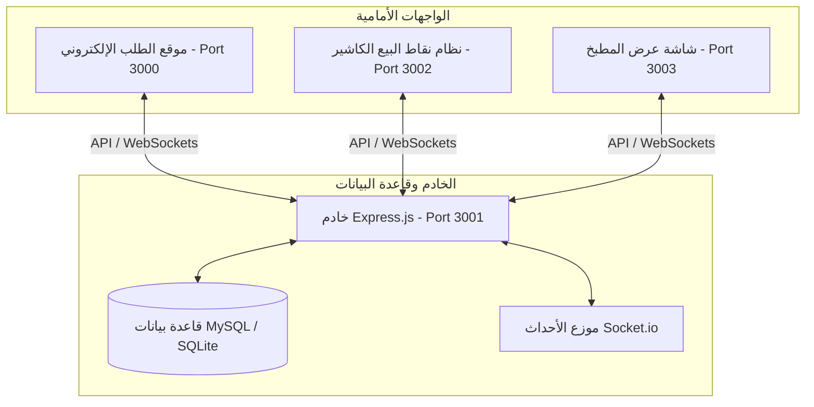
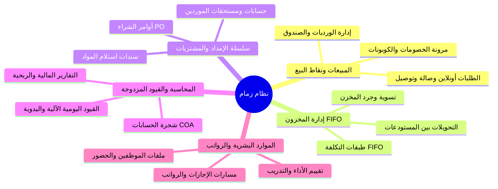
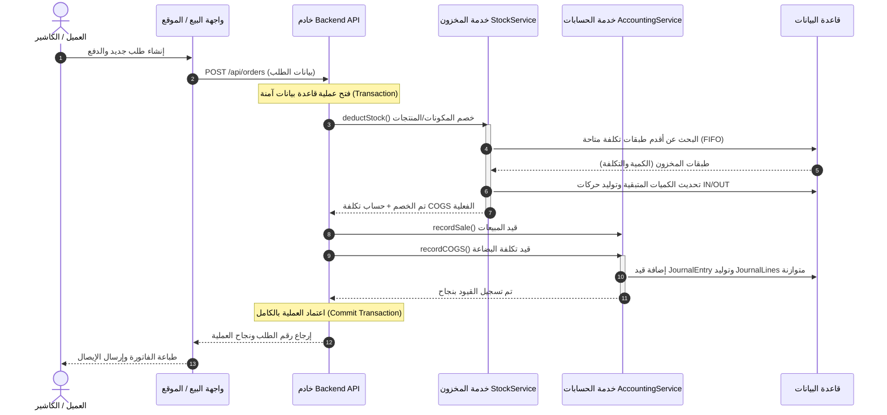

# تقرير فهم بنية وتفاصيل مشروع نظام زمام (Zimam POS & ERP-lite System)

مرحباً بك! لقد قمت بفحص كود وهيكل المشروع بالكامل، وتفحصت الموديلات، والخدمات، ومسارات النهاية (API Routes)، والواجهات الأمامية. هذا المشروع ليس مجرد نظام نقاط بيع بسيط، بل هو **نظام متكامل لتشغيل وإدارة المطاعم والشركات التجارية (ERP-lite)** يتضمن قنوات بيع متعددة، ونظام محاسبي متكامل بالقيود المزدوجة، وإدارة مخزون متقدمة بآلية FIFO، وموديول متكامل للموارد البشرية والرواتب.

فيما يلي تقرير مفصل يوضح البنية البرمجية والتدفقات الأساسية للنظام.

---

## 🗺️ 1. نظرة عامة ومعمارية النظام (System Architecture)

يعتمد النظام على بنية **الخادم والعميل (Client-Server Architecture)** مع واجهات متعددة تتصل بخادم مركزي موحد عبر بروتوكولات REST API و WebSockets (Socket.io) لضمان المزامنة الفورية للبيانات.

### 📦 المكونات الرئيسية للمشروع:
1. **الخادم الخلفي (`backend/`)**: مبني باستخدام **Node.js** و **Express.js**، ويعتمد على **Sequelize ORM** لإدارة قواعد البيانات. يدعم بيئتي عمل:
   - **SQLite**: للاستخدام المحلي والتطوير السريع (تُحفظ البيانات في `backend/data/restaurant.db`).
   - **MySQL**: الجاهزة للإنتاج الفعلي لضمان الكفاءة والأمان.
2. **تطبيق نقاط البيع (`pos/`)**: تطبيق ويب أحادي الصفحة (SPA) مبني بـ **React** و **Vite** و **Redux Toolkit** لإدارة الحالة. يمثل لوحة التحكم الرئيسية للكاشير والمديرين والمحاسبين ومسؤولي الموارد البشرية. يدعم ميزات PWA للعمل بدون إنترنت وإمكانية التثبيت.
3. **موقع الطلب الإلكتروني (`website/`)**: تطبيق ويب (React + Vite + Redux) يتيح للزبائن تصفح المنيو، إضافة الطلبات للسلة، إدخال بياناتهم وتتبع حالة الطلب لحظة بلحظة عبر الـ WebSockets.
4. **نظام شاشة المطبخ (`kds/`)**: تطبيق (React + Vite) مخصص للمطبخ لعرض الطلبات النشطة، مزود بمؤقت لحساب عمر الطلب وتنبيهات صوتية عند وصول طلبات جديدة.
5. **مجموعة سكربتات التشغيل والربط (`scripts/` و `start-all.js`)**: تتيح تشغيل جميع المنظومات دفعة واحدة مع بناء خادم وسيط (Proxy) لتوجيه الطلبات.

---

## 🛠️ 2. تشريح الموديولات البرمجية الأساسية (Core Modules)

تتوزع الملفات والخدمات البرمجية لتشكل موديولات مترابطة تغطي كافة العمليات التشغيلية والمالية:

---

### 🛍️ أ. موديول المبيعات والطلبات والورديات
* **دورة حياة الطلب**: يدعم النظام الطلبات المحمولة (Takeaway)، الطلبات المحلية (Dine-in)، والتوصيل (Delivery) بالإضافة لطلبات الإنترنت.
* **إدارة الورديات (Shifts) والصندوق (Cash Drawers)**:
  - يتم التحكم ببدء ونهاية الوردية عبر `ShiftProvider.jsx` وخدمة `shiftService.js`.
  - يتطلب النظام تسجيل النقد الافتتاحي والنقد الفعلي عند الإغلاق لحساب الفروقات المالية العجز/الزيادة وعمل تسوية محاسبية فورية.
  - تدعم العمليات النقدية تسجيل النقد الداخل (Cash-In) والخارج (Cash-Out) عبر `cashDrawerService.js`.

---

### 📦 ب. موديول إدارة المخزون وسلسلة الإمداد (FIFO Costing)
يحتوي النظام على إدارة مخزون متقدمة جداً تعمل بدقة عالية وتضمن تقييم أصول المتجر بشكل سليم:
* **تقييم المخزون بآلية FIFO (الوارد أولاً يصرف أولاً)**:
  - عند استلام بضائع عبر المشتريات، يتم إنشاء **طبقة تكلفة (Cost Layer)** في جدول حركات المخزون `StockMovement` بقيمة كمية متبقية `remaining_quantity` مساوية للكمية المستلمة.
  - عند البيع أو الصرف، تقوم الدالة `deductStock` في `stockService.js` بسحب الكميات من أقدم طبقات المخزن المتاحة وتخفيض الكمية المتبقية في تلك الطبقات.
  - يتم حساب **تكلفة البضاعة المباعة (COGS)** بدقة متناهية بناءً على التكلفة الفعلية للطبقات التي سُحب منها.
* **إدارة المشتريات والموردين**:
  - يبدأ بطلب الشراء `PurchaseOrder` ثم سند استلام البضائع `PurchaseReceipt` الذي يقوم فوراً بإدخال الكميات للمخزن وإنشاء طبقات التكلفة المحاسبية.
  - يدعم النظام سداد مستحقات الموردين `SupplierPayment` مع تحديث أرصدة الموردين فوراً وتوثيقها محاسبياً.
  - يدعم مرتجعات المشتريات `PurchaseReturns` للتعامل مع البضائع التالفة مع تحديد طبقة التكلفة المتأثرة.

---

### ⚖️ ج. موديول المحاسبة المالية والقيود المزدوجة (Double-Entry Ledger)
هذا الموديول يمثل العمود الفقري المالي للنظام، حيث يتفوق على الأنظمة المنافسة بعدم اعتماده على الحسابات السطحية بل على هيكل محاسبي متكامل:
* **شجرة الحسابات (Chart of Accounts - COA)**:
  - هيكلية مبنية بدقة (Assets, Liabilities, Equity, Income, Expenses) عبر ملف `seed-chart-of-accounts.js` وخدمة `coaManagementService.js`.
  - يدعم النظام الحسابات الرئيسية (Group Accounts) والحسابات الفرعية القابلة للتقييد (Detail Accounts).
* **التكامل التلقائي للأحداث (Event-Driven GL Integration)**:
  - يقوم الكلاس `AccountingHooks.js` بالاستماع لكافة حركات النظام وتوليد قيود يومية تلقائية مزدوجة ومتوازنة (Debits = Credits) عبر خدمة `accountingService.js` عند حدوث:
    - **إتمام طلب**: يُسجل القيد المحاسبي (من حساب الصندوق/البنك/المدينين إلى حساب المبيعات) + قيد تكلفة البضاعة المباعة (من حساب COGS إلى حساب المخزن).
    - **استلام مشتريات**: (من حساب المخزن إلى حساب الموردين / النقدية).
    - **سداد مورد**: (من حساب الموردين إلى حساب الصندوق/البنك).
    - **إرجاع طلب**: يُنشئ قيد المرتجعات ويعكس التكاليف ويُعيد البضاعة للمخزن ويعدل حساب المخازن.
    - **تسجيل المصاريف**: (من حساب المصروف المحدد إلى حساب الصندوق/البنك) عبر `expenses.js`.
    - **رواتب الموظفين**: يُولد قيود استحقاق وسداد الرواتب تلقائياً.
* **التقارير المحاسبية المتقدمة**:
  - يوفر موديول التقارير المالية `FinancialReports.jsx` تقارير أساسية:
    - **ميزان المراجعة (Trial Balance)**.
    - **قائمة الدخل (Profit & Loss)**.
    - **الميزانية العمومية (Balance Sheet)**.
    - **قائمة التدفقات النقدية (Cash Flow Statement)**.
* **فترات الضبط المالي والأمان**:
  - إمكانية قفل الفترات المالية `FiscalPeriod` لمنع التعديل على الحركات القديمة بعد المراجعة السنوية أو الشهرية.
  - مراجعة وتتبع شامل للتعديلات في سجل تدقيق القيود (`GLAuditLog`).
  - دعم إرفاق المستندات الورقية والفواتير بالقيود اليومية إلكترونياً.

---

### 👥 د. موديول الموارد البشرية والرواتب (HR & Payroll)
يوفر نظام زمام نظاماً متكاملاً لإدارة شؤون الموظفين مما يجعله نظام تشغيل متكامل للشركات:
* **بيانات الموظفين**: تخزين بيانات الموظفين، الأقسام (Departments)، والمسميات الوظيفية (Designations).
* **إدارة الحضور والإجازات**: تتبع حضور الموظفين يومياً وحساب رصيد الإجازات المتبقية وطلبات الإجازات.
* **مسيرات الرواتب**: حساب الرواتب الشهرية والبدلات والاستقطاعات، مع دعم ربط موظفي التوصيل والكاشير بقائمة الموارد البشرية وتخصيص رواتب افتراضية لهم في الـ `.env`.

---

### 🖨️ هـ. نظام الطباعة والأجهزة الطرفية (Device & Print Manager)
يحتوي النظام على معالج طباعة متقدم `printService.js` يتيح للكاشير:
* تعريف وإدارة الطابعات المتصلة بالشبكة أو طابعات USB المحلية عبر شاشة `DeviceManager.jsx`.
* تعديل قوالب الطباعة (إيصال العميل، بون المطبخ، تقارير نهاية اليوم) عبر محرر القوالب `TemplateEditor.jsx` بدعم كامل للغة العربية.
* تحويل الإيصالات إلى صور لإرسالها للعملاء عبر الواتساب لتوفير الورق.

---

## 🔄 3. تدفق البيانات المالي والتشغيلي (Sales to GL Flow)

يوضح المخطط التالي كيف يتحول حدث بيع بسيط في الكاشير أو الموقع إلى حركات مخزنية وقيود محاسبية متكاملة بصورة فورية وتلقائية:

---

## 💡 4. نقاط القوة والمزايا البرمجية في المشروع

بالمقارنة مع المشاريع التقليدية، يتميز كود مشروع "زمام" بالتالي:

1. **أمان العمليات المالي وقفل التنافسية (Database Transactions & Locking)**:
   جميع العمليات الحساسة (مثل البيع، الخصم من المخزون، صرف الرواتب، استلام المشتريات) مُغلفة داخل عمليات Sequelize المحمية (`sequelize.transaction`). هذا يضمن أنه في حال فشل أي خطوة (مثلاً فشل المحاسبة)، يتم التراجع عن العملية بالكامل (Rollback) ولا تُترك قاعدة البيانات في حالة معطوبة. كذلك يُستخدم قفل السطور (`SELECT FOR UPDATE`) لمنع تعارض مبيعات المنتجات في نفس اللحظة.
2. **فصل منطق الأعمال (Separation of Concerns)**:
   هناك فصل واضح بين طبقة البيانات والموديلات (`models/`)، وطبقة التحقق من المدخلات ومسارات العناوين (`routes/` & `validators/`)، وطبقة منطق الأعمال المعقدة والعمليات المحاسبية والمخزنية التي تم عزلها داخل خدمات مستقلة (`services/`).
3. **التصميم المتجاوب والدعم الكامل للغة العربية و RTL**:
   تعتمد واجهات الـ POS والموقع والمطبخ على خط Cairo وتصميم RTL ممتاز ومريح للعين مع سمات تناسب إضاءة الكاشير والمطبخ (Dark Mode).
4. **تجنب تكرار الطلبات (Idempotency Middleware)**:
   يستخدم النظام وسيط التحقق من مفتاح التكرار `idempotency.js` لضمان عدم تكرار الخصم المالي أو استلام نفس الطلب مرتين إذا قام المستخدم بالضغط متكرراً على زر الدفع.
5. **سجل تتبع ومراقبة العمليات (Activity Audit & Logger)**:
   يسجل النظام كل نشاط للمستخدمين عبر وسيط `activityAudit.js` ويقوم بتوجيه جميع السجلات والمستندات المحاسبية المحذوفة لحذف منطقي (Soft Delete) لحفظ الأمان المالي.

---

## 📈 5. خارطة الطريق المقترحة والخطوات القادمة (Roadmap)

بناءً على وثائق التطوير المرفقة بالمشروع (`ZIMAM_SYSTEM_IMPROVEMENT_PLAN.md` و `ZIMAM_PROGRESS_MEMORY.md`):

* **التركيز الحالي (Restaurant-First)**:
  * يوصى بالتركيز على إكمال **نظام إدارة الطاولات (Table Management System)** وشاشة الحجوزات لتفعيل النظام كحل متكامل ومثالي للمطاعم والمقاهي.
  * تحسين شاشة الكاشير لتتيح تحديد تفاصيل الوجبات والخيارات الإضافية (Modifiers / Add-ons / Variants / Combos) بكفاءة للموظف الكاشير.
* **الجاهزية للإنتاج (Production Readiness)**:
  * النظام جاهز تماماً للتشغيل الفعلي على قواعد بيانات MySQL.
  * يفضل توفير واجهة مستخدم متكاملة لعرض وتحميل ميزان المراجعة والميزانية العمومية بصورة أسهل للمحاسبين بدلاً من الاعتماد الكلي على العمليات الخلفية فقط.

---

### 📝 الخلاصة
مشروع نظام زمام هو بنية برمجية **شديدة التماسك وعالية الاحترافية** في إدارة الجوانب المالية والمخزنية. تم بناؤه بمعايير أنظمة الـ ERP الكبيرة مع الحفاظ على مرونة وسرعة وتحديثات تطبيقات الويب اللحظية عبر تقنيات React و WebSockets.
